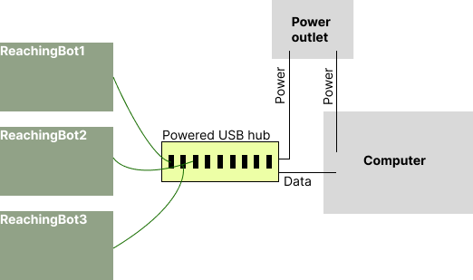
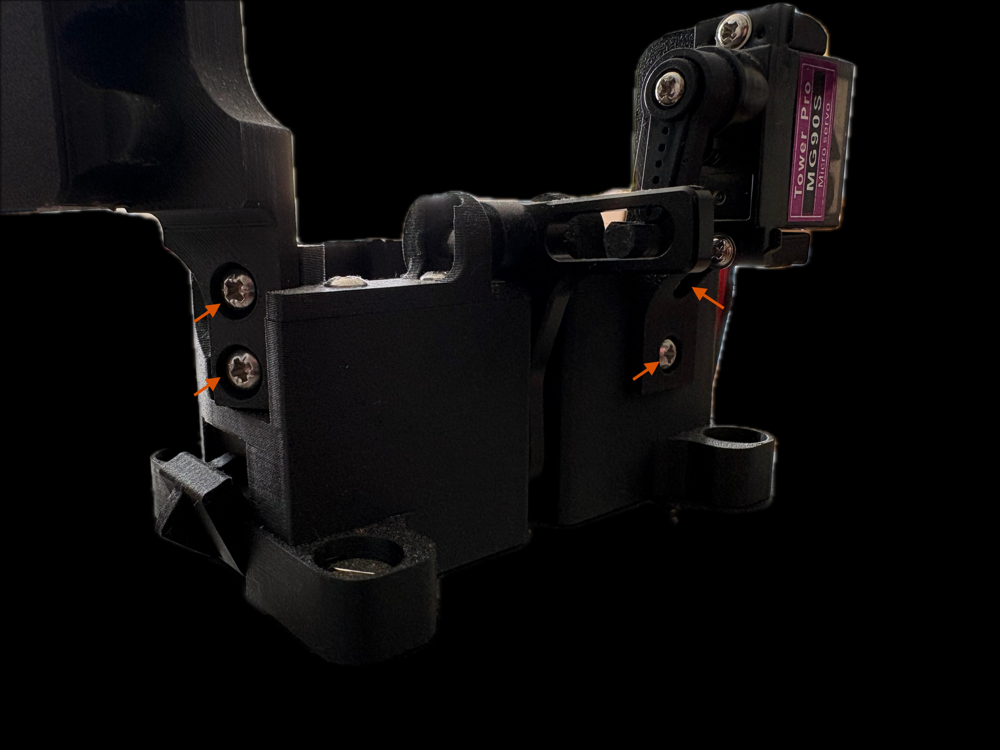
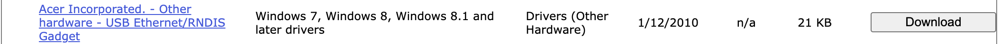

# Getting Started

### Installation of ReachingBot Device Manager

A link to the latest ReachingBot device manager software can be downloaded and installed from the [Downloads Page](https://www.notion.so/Downloads-2d33df1f8acd4d5b9f688063dc2d0fa3?pvs=21).

Follow the on-screen instructions until the desktop application is installed. Windows and Mac OSX installers are available. Please note that the Mac OSX installer is not backwards compatible and requires firmware version 3>.

A walkthrough of ReachingBot Device Manager can be found [here](https://youtu.be/fuWDxj7Tz7A).

[https://youtu.be/fuWDxj7Tz7A](https://youtu.be/fuWDxj7Tz7A)

### Connection layout

ReachingBots are connected to your PC via the supplied powered USB hub. Connect each ReachingBot to one of the 7 USB ports on the powered hub that are blue. These ports can supply power to the devices and also allow your PC to communicate with them too. The bottom most three can only supply power so should not be used.

You can also connect your ReachingBot directly to your PC using the supplied USB A - USB C cable , but, be mindful that your PC may not be able to supply its required power, and lead to unstable behaviour. For this reason, it is recommended that the supplied powered USB hub is used.

### Before you begin

Your ReachingBot may arrive disassembled for safe travel. Please screw together the components indicated by the red arrows in the image above before continuing.

### Chamber assembly

Chambers are made from clear acrylic panels that assemble together using the supplied M3 x 20 mm screws and square nuts. Use [this video](https://www.youtube.com/watch?v=szwCmlw77bg) as a visual guide on how to assemble these chambers. In order to increase the contrast between the pellets and the background from with the camera frame, a dark backdrop is also supplied, which can be inserted into the front panel.

[https://www.youtube.com/watch?v=szwCmlw77bg](https://www.youtube.com/watch?v=szwCmlw77bg)

The chamber remains in a fixed position relative to the dispensing unit. The dispensing unit can be moved via the guides within the aluminium base and fixed together with the clamps.

Note, when the dispenser is positioned in the “shaping” position, i.e. as close to the front panel of the chamber as possible, the backdrop will need to be positioned within the chamber. This can be re-positioned to the outside of the chamber once the animal learns to grasp for pellets with the dispenser in its furthest position if the user wishes to do so.

### Drivers

Before the ReachingBot Device Manager can recognise your devices, you will first need to change the device drivers. You will only need to do this once for any given PC you chose to use with your devices. You will also only need to do this for one ReachingBot, not each one.

For a visual demonstration on how to do this, watch [this YouTube video](https://www.youtube.com/watch?v=XaTmG708Mss) from the 7:20 minute mark.

1. **Download the correct drivers**

You can do this by navigating to [this](https://www.catalog.update.microsoft.com/Search.aspx?q=USB+RNDIS+Gadget) page and downloading the driver pictured in the below screenshot:

Download and unpack its contents in a known location on your PC.

1. **Navigate to the Device Manager on your PC and find where the ReachingBot is connected**

It should be listed as a COM port, i.e. **COM3**

1. **Right click this device and choose “Update driver”** under advanced settings. It will give you the option to either locate the driver automatically over the internet, or manually.

Chose manually, and navigate to the folder where you previously downloaded the driver.

This will now update the drivers for the ReachingBots and you will be able to connect to them from within the ReachingBot Device Manager software.
