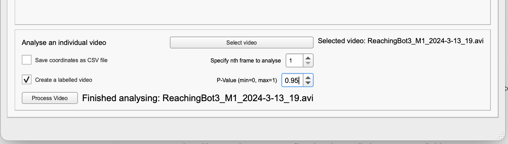

# Outcome classification: *things to note*

ReachingBot Device Manager comes equipped with a machine-learning based video outcome classifier that makes a prediction of what happened during the short video snippets recorded. Currently, the possible outcomes are as follows:

| **Outcome** | **Description** |
| --- | --- |
| Hit | The animal successfully takes the pellet, bringing it to its mouth without dropping it at any point in the video trial and eats the pellet in full. |
| Miss | The pellet was displaced from the pedestal but is knocked away or dropped in the retraction phase. Even if the mouse successfully takes the pellet, brings it to its mouth but then drops it, this will count as a miss. |
| PelletNotTaken | This is an edge case, but occasionally videos may be recorded wrongly with pellets remaining on the pedestal |
| PelletNotPresentInVideo | Occasionally, a video will be recorded where there isn’t a pellet present at the start of the video. |

(Please also see [our paper published in J Neuro Methods](https://pubmed.ncbi.nlm.nih.gov/37331430/) for more detail)

For the best chance of optimal prediction accuracy, move the dispenser to the furthest position away from the slot so as not to allow animals to cheat and grasp for pellets with their tongue.

Finally, ensure the the front panel is as clear as possible so as to give the camera the best chance as possible to “see” the mouse having taken or dropped the pellet.

## Using custom DeepLabCut models

From RBDM version 2.5.0>, we added the ability to use custom DeepLabCut models. That is, models that have been fine-tuned by **auto***s*cientic based on videos that you have collected.

The way to point your RBDM to the model you’d like to use is by specifying it in the config.yaml file, like so:

```yaml
PoseEstimationModel: /path/to/folder/DLC_autoscientific_reachingBot_resnet_50_iteration-6_shuffle-1
```

***n.b.** It’s the path to the entire folder that you should specify*

Please note: because of the nature of machine learning models, prediction accuracy cannot be guaranteed, and is up to the user to confirm that the prediction accuracy of video outcomes are maintained.

The outcome classifier depends on the integrated DeepLabCut model working well. If the environment that you have set your ReachingBots differ significantly from the environment the model was initially trained, this may lead to inaccurate feature tracking. You can confirm this by choosing a video from the interface below within the RBDM software, clicking the “**create a labelled video”** radio button, and then **“Process Video”.** If you find that the model does not work well, it may need to be re-trained.

We cannot guarantee the models we train using DeepLabCut will track the features of rodents reliably enough for kinematic/trajectory analysis. Users are encouraged to train their own models for this purpose.



Please reach out to [info@autoscientific.co.uk](mailto:info@autoscientific.co.uk) if alterations need to be made and we can explore this together.
